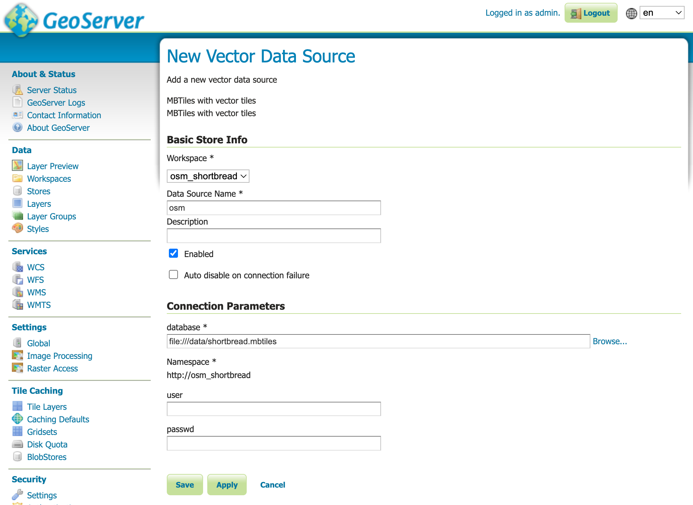

# GeoServer MBTiles Setup with Shortbread Vector Tiles

A comprehensive guide to set up GeoServer with MBTiles vector tiles using the [Shortbread schema](https://shortbread-tiles.org/). This setup uses [Planetiler](https://github.com/onthegomap/planetiler) for tile generation and GeoServer's MBStyle plugin for styling.

## 📋 Table of Contents

- [Overview](#overview)
- [Prerequisites](#prerequisites)
- [GeoServer Setup](#geoserver-setup)
- [Creating Shortbread Vector Tiles](#creating-shortbread-vector-tiles)
- [Adding MBTiles to GeoServer](#adding-mbtiles-to-geoserver)
- [Screenshots](#screenshots)
- [Troubleshooting](#troubleshooting)
- [Resources](#resources)
- [Contributing](#contributing)

## 🌟 Overview

This repository provides a complete workflow for:

- 🔧 Setting up GeoServer with required extensions
- 🗺️ Generating vector tiles using Planetiler and the Shortbread schema
- 🎨 Styling tiles with MBStyle format
- 🚀 Serving vector tiles through GeoServer

## ✅ Prerequisites

Before you begin, ensure you have:

- **GeoServer** (version 2.20+ recommended)
- **Docker** (for running Planetiler)
- **Java 11+** (for GeoServer)
- Basic knowledge of GeoServer administration

## 🛠️ GeoServer Setup

To use MBTiles in GeoServer, you'll need to install the following extensions:

### Required Extensions

1. **MBStyles Extension**

   - Download from the [GeoServer release page](https://docs.geoserver.org/stable/en/user/styling/mbstyle/installing.html)
   - Enables MBStyle format support for styling

2. **MBTiles Store Community Module**
   - Download `mbtiles-store-plugin` from [GeoServer nightly builds](https://docs.geoserver.org/stable/en/user/community/mbtiles/installing.html)
   - Enables reading MBTiles as data stores

### Installation Guide

For detailed installation instructions, see: [How to Install GeoServer Extensions the Right Way](https://dev.to/ronitjadhav/how-to-install-geoserver-extensions-the-right-way-4e78)

## 🗺️ Creating Shortbread Vector Tiles

Use Planetiler with Docker to generate vector tiles for your area of interest:

### Example: Generating tiles for Nordrhein-Westfalen (Germany)

```bash
# Create data directory
mkdir data

# Generate MBTiles using Planetiler
docker run --rm --user=$UID \
  -v $PWD/data:/data \
  ghcr.io/onthegomap/planetiler shortbread.yml \
  --download \
  --area=Nordrhein-Westfalen \
  --output=/data/shortbread.mbtiles
```

### Other Available Areas

You can replace `Nordrhein-Westfalen` with other areas like:

- `germany` (entire country)
- `europe` (continent)
- `bavaria` (German state)
- Or any other area supported by Planetiler

## 📦 Adding MBTiles to GeoServer

Follow these steps to add your generated MBTiles to GeoServer:

### Step 1: Copy MBTiles File

Copy the generated `.mbtiles` file to your GeoServer data directory:

```bash
cp data/shortbread.mbtiles /usr/share/geoserver/data_dir/data/
```

### Step 2: Create Workspace and Data Store

1. **Create a new workspace**

   - Open GeoServer admin interface
   - Navigate to "Workspaces" → "Add new workspace"

2. **Add new data store**
   - Go to "Stores" → "Add new Store"
   - Select "MBTiles with vector tiles"


### Step 3: Configure Data Store

Enter the required details:

- **Database field**: Full path to your `.mbtiles` file
- **Workspace**: Select your created workspace



### Step 4: Publish Layers

- Publish all available layers from the store
- Configure layer settings as needed


### Step 5: Add MBStyle

1. Navigate to "Styles" → "Add new style"
2. Select format: `mbstyle`
3. Copy the content from [`styles/versatile-style.mbstyle`](styles/versatile-style.mbstyle)
4. Save the style (ignore any validation errors)

> **Note**: The MBStyle in this repository is based on the [VersaTiles colorful style](https://github.com/versatiles-org/versatiles-style) with modifications to make it compatible with GeoServer and the Shortbread schema.


### Step 6: Create Layer Group

1. Go to "Layer Groups" → "Add new layer group"
2. Add your published layers
3. Apply the MBStyle you created


### Step 7: Preview

Navigate to "Layer Preview" and preview your layer group using OpenLayers.


### Step 8: Configure WMS Settings (Important!)

If you encounter errors during preview, you need to update the WMS configuration:

1. Navigate to your GeoServer data directory:

   ```bash
   cd /usr/share/geoserver/data_dir
   ```

2. Edit the `wms.xml` file and update the `maxRequestMemory` setting:

   ```xml
   <maxRequestMemory>0</maxRequestMemory>
   ```

3. Restart GeoServer for the changes to take effect

> **Note**: Setting `maxRequestMemory` to `0` removes memory limits for WMS requests, which is necessary for rendering complex vector tile layers. This prevents memory-related errors during preview.

## 🔧 Troubleshooting

### Common Issues

#### Style validation errors

- MBStyle validation errors can usually be ignored during upload
- Ensure the style format is set to `mbstyle`

#### MBTiles not loading

- Verify the full path to the `.mbtiles` file in the Database field
- Check file permissions on the MBTiles file
- Ensure the MBTiles store plugin is properly installed

#### Layers not appearing

- Verify that all layers are published from the store
- Check layer group configuration
- Ensure the coordinate reference system (CRS) is correctly set

#### Preview errors or memory issues

- Update `wms.xml` in your GeoServer data directory (`/usr/share/geoserver/data_dir/wms.xml`)
- Set `<maxRequestMemory>0</maxRequestMemory>` to remove memory limits
- Restart GeoServer after making the change
- This is essential for rendering complex vector tile layers

### Performance Tips

- Use appropriate zoom levels for your use case
- Consider creating multiple layer groups for different zoom ranges
- Monitor GeoServer memory usage with large MBTiles files

## 📚 Resources

- [Shortbread Schema Documentation](https://shortbread-tiles.org/)
- [Planetiler GitHub Repository](https://github.com/onthegomap/planetiler)
- [VersaTiles Style (Original Source)](https://github.com/versatiles-org/versatiles-style) - Colorful style for VersaTiles
- [GeoServer MBTiles Documentation](https://docs.geoserver.org/stable/en/user/community/mbtiles/)
- [MBStyle Extension Documentation](https://docs.geoserver.org/stable/en/user/styling/mbstyle/)
- [GeoServer Extension Installation Guide](https://dev.to/ronitjadhav/how-to-install-geoserver-extensions-the-right-way-4e78)

## 🤝 Contributing

Contributions are welcome! Please feel free to:

- Report issues
- Suggest improvements
- Submit pull requests
- Share your experiences

---

_This guide was created to simplify the process of setting up vector tiles in GeoServer. For questions or support, please open an issue._
