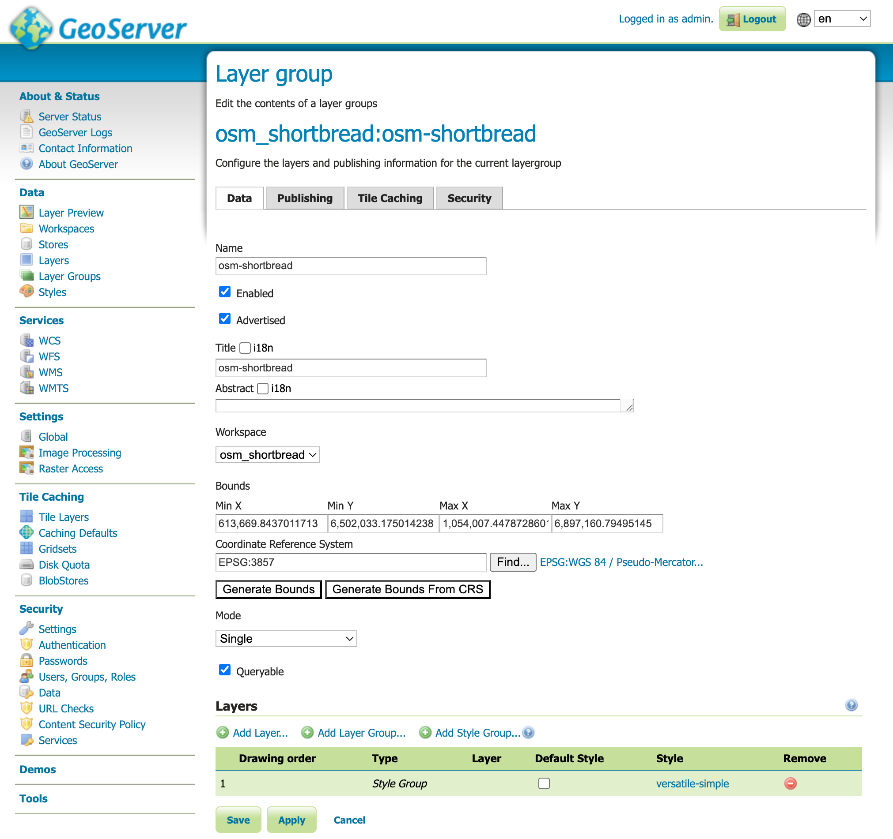

# GeoServer MBTiles Setup with Shortbread Vector Tiles

A comprehensive guide to set up GeoServer with MBTiles vector tiles using the [Shortbread schema](https://shortbread-tiles.org/). This setup uses [Planetiler](https://github.com/onthegomap/planetiler) for tile generation and GeoServer's MBStyle plugin for styling.

## 📋 Table of Contents

- [Overview](#overview)
- [Prerequisites](#prerequisites)
- [Quick Start](#quick-start)
- [Creating Shortbread Vector Tiles](#creating-shortbread-vector-tiles)
- [GeoServer Setup](#geoserver-setup)
- [Adding MBTiles to GeoServer](#adding-mbtiles-to-geoserver)
- [Screenshots](#screenshots)
- [Troubleshooting](#troubleshooting)
- [Resources](#resources)
- [Contributing](#contributing)

## 🌟 Overview

This repository provides a complete workflow for:

- 🔧 Setting up GeoServer with required extensions
- 🗺️ Generating vector tiles using Planetiler and the Shortbread schema
- 🎨 Styling tiles with MBStyle format
- 🚀 Serving vector tiles through GeoServer

## ✅ Prerequisites

Before you begin, ensure you have:

- **Docker and Docker Compose** (for running GeoServer and Planetiler)
- Basic knowledge of Docker and GeoServer administration

## 🚀 Quick Start

1. **Clone this repository**:
   ```bash
   git clone <repository-url>
   cd geoserver-shortbread-mbtiles
   ```

2. **Generate MBTiles data**:
   ```bash
   # Generate vector tiles for your area of interest
   docker run --rm --user=$UID \
     -v $PWD/data:/data \
     ghcr.io/onthegomap/planetiler shortbread.yml \
     --download \
     --area=Nordrhein-Westfalen \
     --output=/data/shortbread.mbtiles
   ```

3. **Start GeoServer and import data**:
   ```bash
   # Start GeoServer
   docker compose up -d
   
   # Run the automated import script
   docker compose run --rm import_data
   ```

4. **View your map**:
   Open this URL in your browser:
   
   http://localhost/geoserver/wms/reflect?layers=osm_shortbread%3Aosm-shortbread&format=application/openlayers
   

That's it! You now have a fully configured GeoServer with styled vector tiles ready to preview.

## 🗺️ Creating Shortbread Vector Tiles

Use Planetiler with Docker to generate vector tiles for your area of interest:

### Example: Generating tiles for Nordrhein-Westfalen (Germany)

```bash
# Generate MBTiles using Planetiler
docker run --rm --user=$UID \
  -v $PWD/data:/data \
  ghcr.io/onthegomap/planetiler shortbread.yml \
  --download \
  --area=Nordrhein-Westfalen \
  --output=/data/shortbread.mbtiles
```

### Other Available Areas

You can replace `Nordrhein-Westfalen` with other areas like:

- `germany` (entire country)
- `europe` (continent)
- `bavaria` (German state)
- Or any other area supported by Planetiler

## 🛠️ GeoServer Setup

This project uses Docker Compose to run GeoServer with all required extensions pre-installed.

**Start GeoServer** (after generating your MBTiles):
```bash
docker compose up -d
```

**Access GeoServer**:
- Open your browser and navigate to `http://localhost/geoserver`
- Default credentials: `admin` / `geoserver`

The Docker setup automatically includes:
- **MBStyles Extension** - for MBStyle format support
- **MBTiles Store Community Module** - for reading MBTiles as data stores
- Optimized Java settings for performance
- GeoServer configuration directory mounted at `./config`
- Data directory mounted at `./data`

## 📦 Adding MBTiles to GeoServer

### Automated Import (Recommended)

The easiest way to set up your MBTiles data in GeoServer is using the automated import script:

```bash
# Run the import script
docker compose run --rm import_data
```

This script will automatically:
- Create the `osm_shortbread` workspace
- Create the `osm` datastore pointing to your MBTiles file
- Publish all available feature types from the MBTiles
- Create the `versatile-simple` MBStyle using the provided style file
- Create an `osm-shortbread` layer group with the style applied
- Configure WMS settings to prevent memory issues during preview

### Re-running the Import Script

If you need to run the import script again (e.g., after updating your MBTiles data), you should first clean up the existing workspace:

```bash
# Delete the entire workspace and all its contents
curl -v -u "admin:geoserver" "http://localhost/geoserver/rest/workspaces/osm_shortbread?recurse=true" -X DELETE
```

This command will remove:
- The `osm_shortbread` workspace
- All layers and feature types
- The `versatile-simple` style
- The `osm-shortbread` layer group

After cleanup, you can run the import script again:

```bash
docker compose run --rm import_data
```

### Manual Import (Alternative)

Follow these steps if you prefer to configure GeoServer manually through the web interface:

### Step 1: Prepare MBTiles File

The generated `.mbtiles` file is already in the correct location in the `/data` directory, which is mounted to the GeoServer container. No additional copying is required.

### Step 2: Create Workspace and Data Store

1. **Create a new workspace**

   - Open GeoServer admin interface
   - Navigate to "Workspaces" → "Add new workspace"

2. **Add new data store**
   - Go to "Stores" → "Add new Store"
   - Select "MBTiles with vector tiles"


### Step 3: Configure Data Store

Enter the required details:

- **Database field**: `/data/shortbread.mbtiles` (path inside the container)
- **Workspace**: Select your created workspace


### Step 4: Publish Layers

- Publish all available layers from the store
- Configure layer settings as needed


### Step 5: Add MBStyle

1. Navigate to "Styles" → "Add new style"
2. Select format: `mbstyle`
3. Copy the content from [`styles/versatile-style.mbstyle`](styles/versatile-style.mbstyle)
4. Save the style (ignore any validation errors)

> **Note**: The MBStyle in this repository is based on the [VersaTiles colorful style](https://github.com/versatiles-org/versatiles-style) with modifications to make it compatible with GeoServer and the Shortbread schema.


### Step 6: Create Layer Group

1. Go to "Layer Groups" → "Add new layer group"
2. Add your published layers
3. Apply the MBStyle you created



### Step 7: Preview

Navigate to "Layer Preview" and preview your layer group using OpenLayers.


### Step 8: Configure WMS Settings (Important!)

If you encounter errors during preview, you need to update the WMS configuration:

1. Navigate to your local config directory:

   ```bash
   cd config
   ```

2. Edit the `wms.xml` file and update the `maxRequestMemory` setting:

   ```xml
   <maxRequestMemory>0</maxRequestMemory>
   ```

3. Restart the GeoServer container:

   ```bash
   docker compose restart geoserver
   ```

> **Note**: Setting `maxRequestMemory` to `0` removes memory limits for WMS requests, which is necessary for rendering complex vector tile layers. This prevents memory-related errors during preview.

## 🔧 Troubleshooting

### Common Issues

#### Style validation errors

- MBStyle validation errors can usually be ignored during upload
- Ensure the style format is set to `mbstyle`

#### MBTiles not loading

- Verify the full path to the `.mbtiles` file in the Database field
- Check file permissions on the MBTiles file
- Ensure the MBTiles store plugin is properly installed

#### Layers not appearing

- Verify that all layers are published from the store
- Check layer group configuration
- Ensure the coordinate reference system (CRS) is correctly set

#### Preview errors or memory issues

> **Note**: WMS settings are automatically configured by the import script. If you used the automated import, memory issues should not occur.

For manual setups:
- Update `wms.xml` in your local config directory (`config/wms.xml`)
- Set `<maxRequestMemory>0</maxRequestMemory>` to remove memory limits
- Restart the GeoServer container: `docker compose restart geoserver`
- This is essential for rendering complex vector tile layers

### Performance Tips

- Use appropriate zoom levels for your use case
- Consider creating multiple layer groups for different zoom ranges
- Monitor GeoServer memory usage with large MBTiles files

## 📚 Resources

- [Shortbread Schema Documentation](https://shortbread-tiles.org/)
- [Planetiler GitHub Repository](https://github.com/onthegomap/planetiler)
- [VersaTiles Style (Original Source)](https://github.com/versatiles-org/versatiles-style) - Colorful style for VersaTiles
- [GeoServer MBTiles Documentation](https://docs.geoserver.org/stable/en/user/community/mbtiles/)
- [MBStyle Extension Documentation](https://docs.geoserver.org/stable/en/user/styling/mbstyle/)
- [GeoServer Extension Installation Guide](https://dev.to/ronitjadhav/how-to-install-geoserver-extensions-the-right-way-4e78)

## 🤝 Contributing

Contributions are welcome! Please feel free to:

- Report issues
- Suggest improvements
- Submit pull requests
- Share your experiences

---

_This guide was created to simplify the process of setting up vector tiles in GeoServer. For questions or support, please open an issue._
